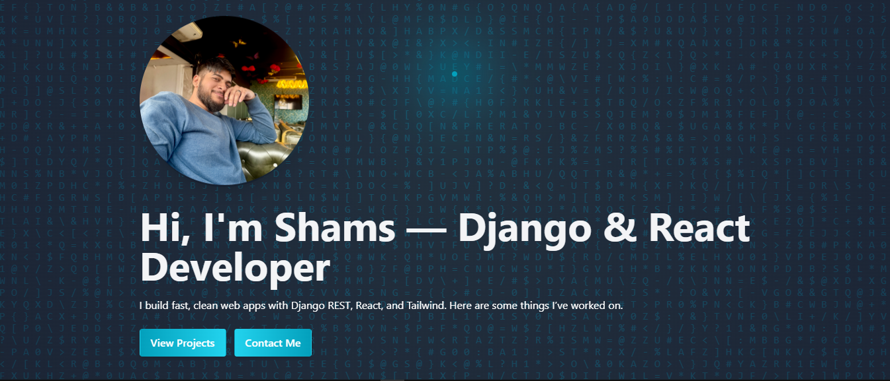
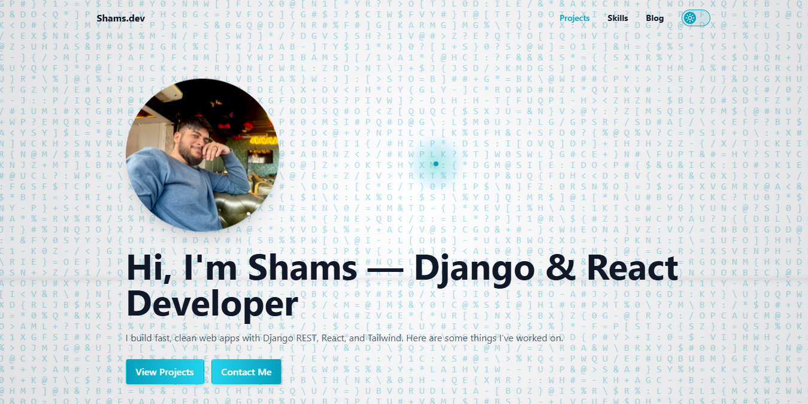
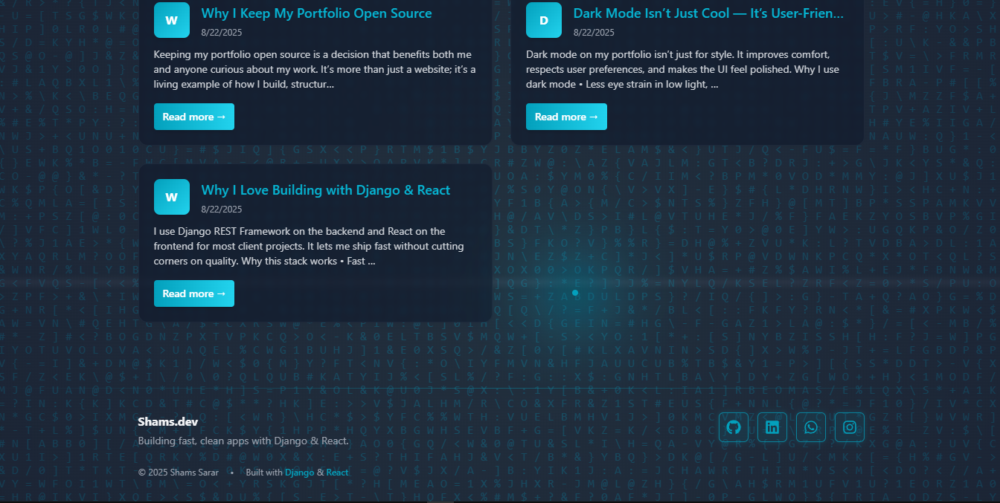

# 🌐 Shams.dev — Personal Portfolio

A modern, responsive portfolio website built with **React (Vite)**, **Django REST API**, and **Tailwind CSS**.  
Showcases my skills, projects, blog posts, and includes a contact form — designed with performance and clean UI in mind.

---

## 🚀 Live Demo
🔗 [Visit Portfolio](https://portfolio-sd-i4mb.onrender.com)

---

## ✨ Features

- 🎨 **Modern UI** — Animated background, gradient buttons, dark/light mode toggle  
- 📱 **Responsive** — Mobile-friendly with a custom hamburger menu  
- 📝 **Blog** — Powered by Django REST API with clean post detail pages  
- 💼 **Portfolio Projects** — Easy to showcase & expand  
- 🌙 **Dark / Light Mode** — Smooth theme toggle with persistence  
- 📬 **Contact Form** — Fully functional with backend integration  
- ⚡ **Fast & Optimized** — Built with Vite, Tailwind, and optimized assets  

---

## 🛠 Tech Stack

**Frontend**
- ⚡ React (Vite)  
- 🎨 Tailwind CSS  
- 🖼 Lucide-react icons  

**Backend**
- 🐍 Django & Django REST Framework  
- 🗄 PostgreSQL  

**Deployment**
- 🌍 Frontend: Render / Vercel / Netlify  
- 🔧 Backend: Render / Railway / Heroku  
- 💾 Database: PostgreSQL  

---

## 📸 Screenshots  

### 🏠 Home



### 📖 Blog


---

## 🏁 Getting Started

### Clone the repo
```bash
git clone https://github.com/shamssarar/Portfolio-cms.git
cd Portfolio-cms

---

### 2. Backend setup (Django)
```bash
cd backend
python -m venv venv
source venv/bin/activate   # On Windows use: venv\Scripts\activate
pip install -r requirements.txt
python manage.py migrate
python manage.py runserver

